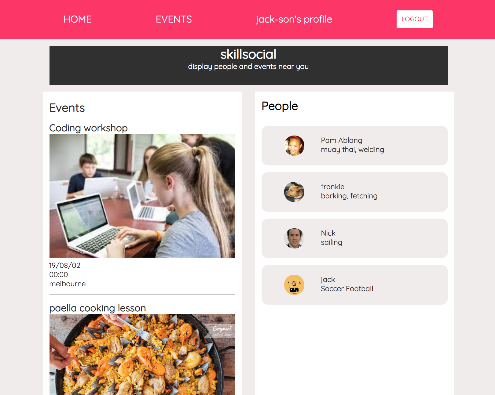
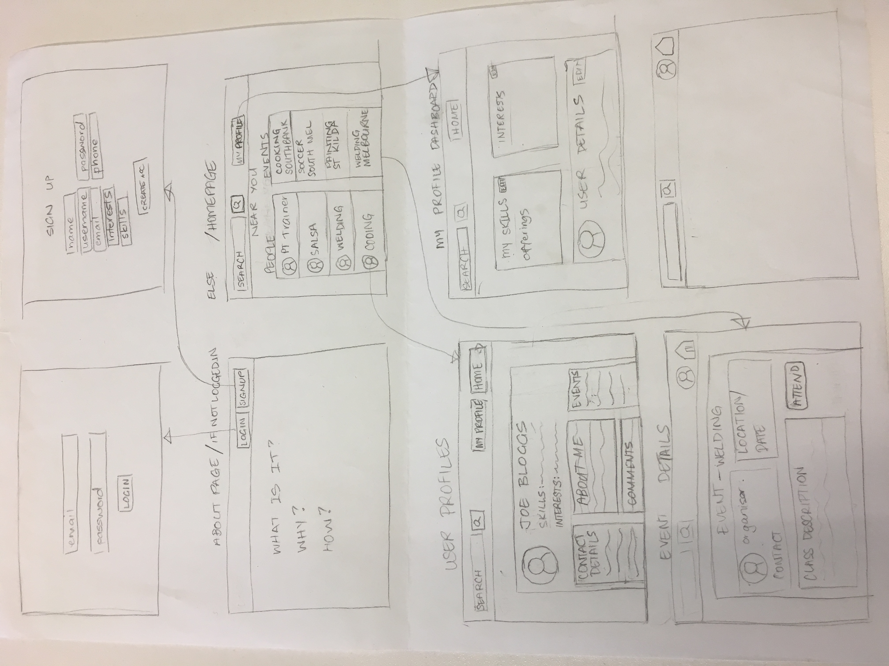
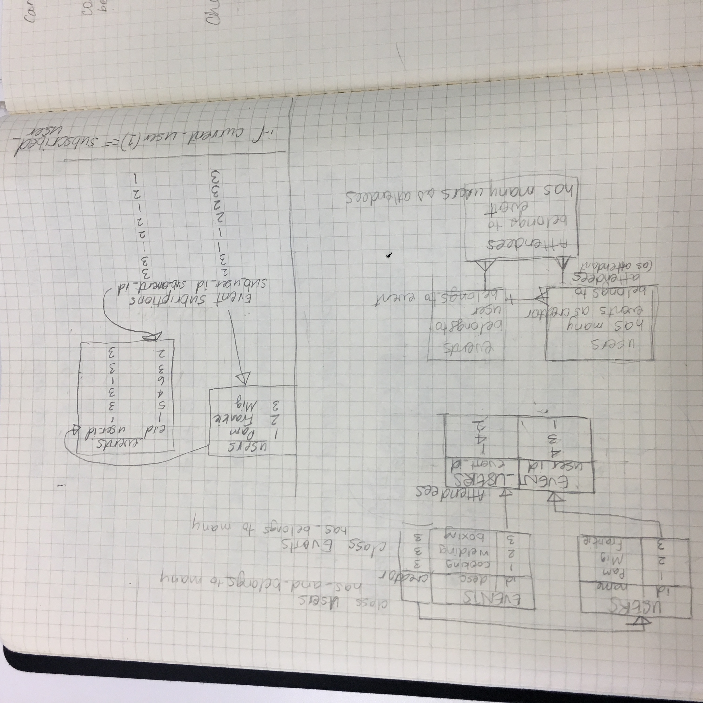

# Skillsocial
Skillsocial is an app that connects people with knowledge who want to share it with people who want to learn something new.  It is also helping to connect real face to face interactions which is lost with youtube university, Udemy and other online courses. A face to face interaction also gives those learning real-time feedback and helps them progress faster.

Here is the link: https://skillsocial-app.herokuapp.com

## App features:

* search events and workshops
* browse through profiles and skills
* create and edit your profile
* create your own workshop or class
* edit your own workshop or class
* leave feedback for your instructor if you have attended their event

## Technologies
* Built in Ruby with Sinatra framework
* Bcrypt gem for password secutiry
* Sinatra Flash for adding notifcations
* Active Record for database mapping
* Postgres Database app

## Approach

Once I had the idea, I planned my steps and tried as best as possible to work through them methodically. Of course, not all always goes according to plan so always changing and updating.

- Decided which were the most important features for an MVP.
- Planned the pages, wireframes and resources.

- Designed the database tables for the resources and their relationships. It helped to draw them up with link them to better understand the relationship.

- Starting with the Users resource, created models, required Bcrypt for password security, created the routes, templates and links.
- I pretty much had the same process for creating the events and comments although with each new resource the relationships were getting more complicated.
- I tried to style a each page along the way only so I could see the basic layout and for readability but most of the styling came at the end.

## Challenges & lessons learnt
- Understanding ActiveRecord features to be able to use it to its full potential. It was alot of reading of the rails guide and stackoverflow to be able to use ActiveRecord to its full potential.
- Styling the CSS. Better planning of the class naming may have helped reduce some of my frustrations. Learning the use of CSS grids and media queries to make a responsive was fun.
- Feature scope, making sure all the must-have features are complete and then prioritising what to do next

## Still to do...

- Search skills and interests through tags.
- Students to be able to give a rating along with the review and perhaps gain points for a badge.-> make a modal box for star rating.
- Set a location and have only local classes and workshops appear.
- Create a private message function between users to be able to set up a private lesson
- I have an idea to add a random workshop/ hobby selector for times when you want to try something new but can't choose.